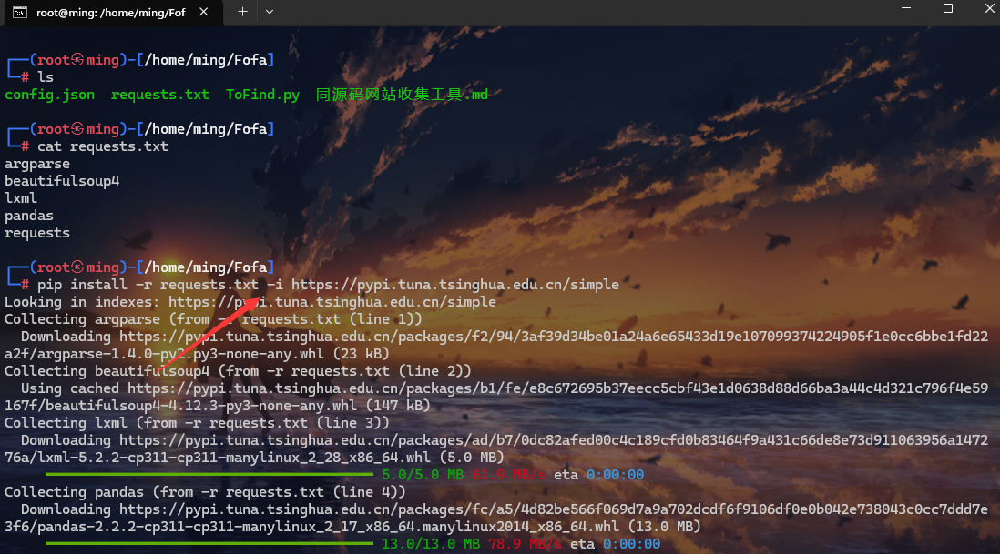
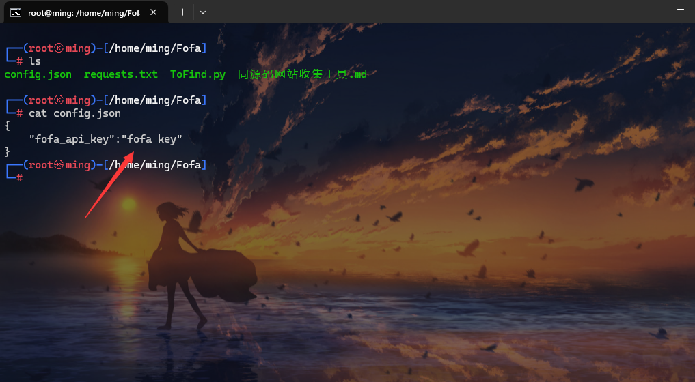
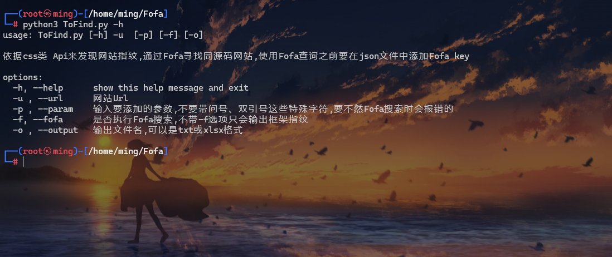
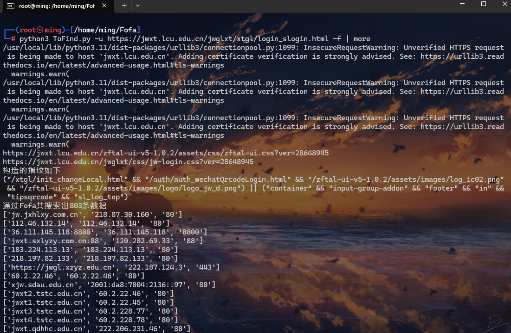
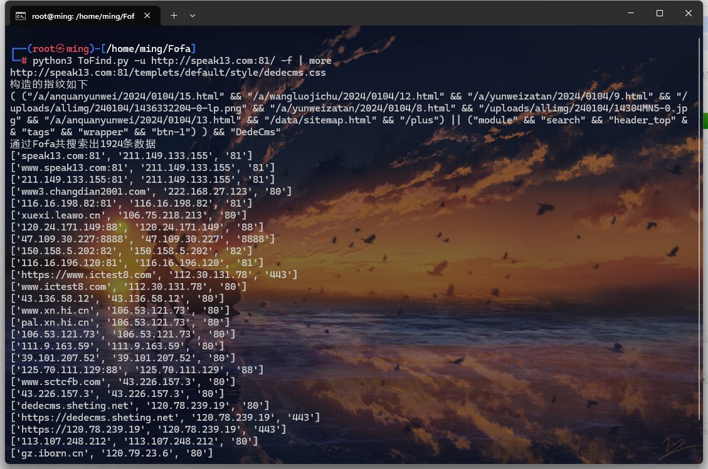
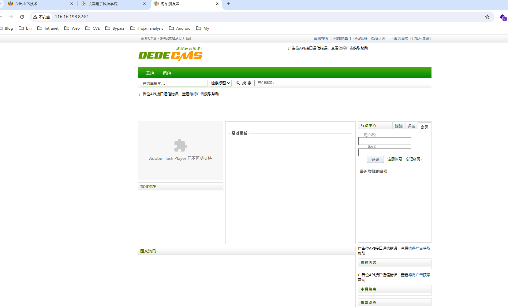
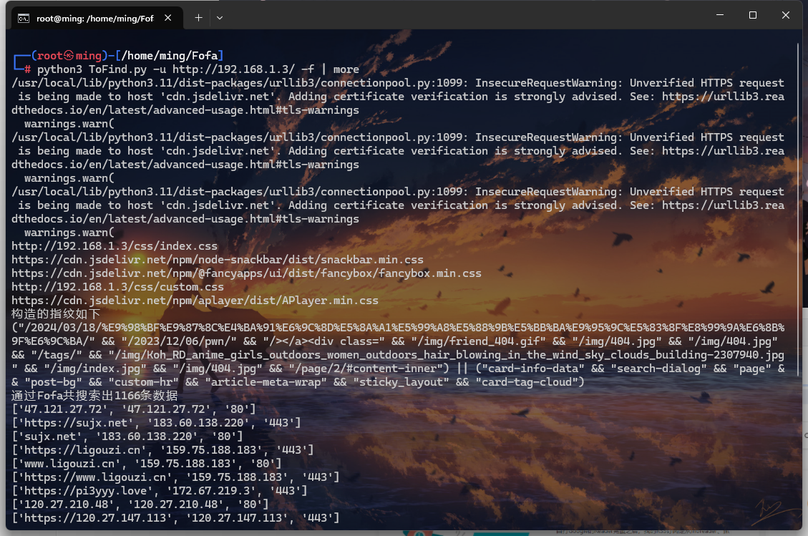
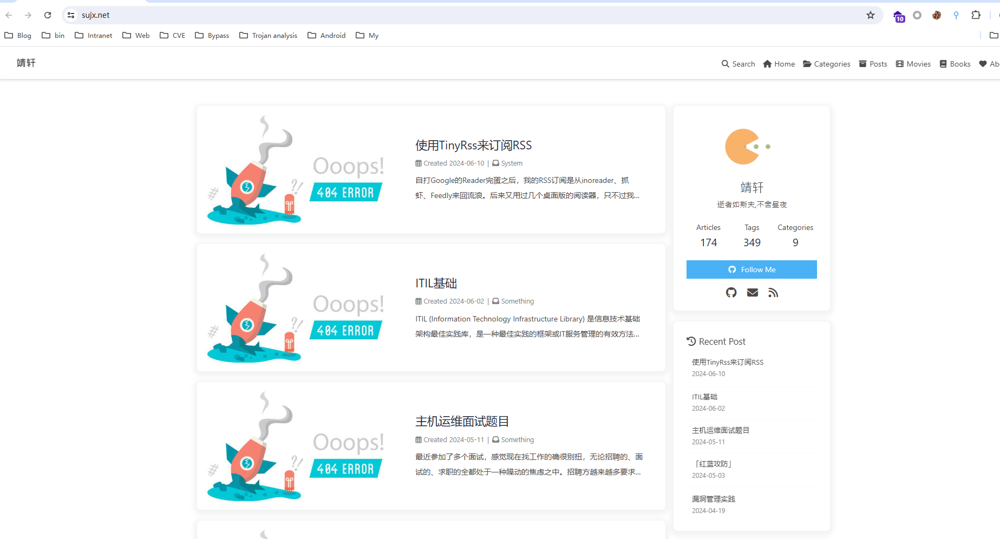

# ToFind
同源码网站收集工具
发现网站特征指纹，通过Fofa搜寻同源网站

## 摘要

这是一个发现网站指纹的工具，依据css、Api等来发现网站指纹，调用Fofa Api搜索同源网站

## 使用方式

### 0x01

通过`requests.txt`文件下载`python3`模板包

```bash
pip install -r requests.txt -i https://pypi.tuna.tsinghua.edu.cn/simple
```



### 0x02

配置`config.json`文件设置`Fofa key`



### 0x03



用法

```bash
python ToFind.py -u http://localhost:4000/                       (提取本地4000端口web服务的网站指纹)        
python ToFind.py -u http://localhost:4000/ -p hexo               (提取web网站指纹并且附加参数“hexo”，如果提取的指纹为“/login”，最后的指纹为                                                                        "/login" && "hexo")
python ToFind.py -u http://localhost:4000/ -f                    (输出网站指纹，并且使用Fofa查询同源的网站并显示在命令行中)
python ToFind.py -u http://localhost:4000/ -f -o 1.txt           (输出网站指纹，使用Fofa查询同源的网站将其保存在1.txt文件中)
python ToFind.py -u http://localhost:4000/ -f -o 1.xlsx          (输出网站指纹，使用Fofa查询同源的网站将其保存在1.xlsx文件中)
```

## 脚本测试

### 0x01

```bash
https://jwxt.lcu.edu.cn/jwglxt/xtgl/login_slogin.html
```


```bash
python3 ToFind.py -u https://jwxt.lcu.edu.cn/jwglxt/xtgl/login_slogin.html -f | more
```




### 0x02

```bash
http://speak13.com:81/
```


```bash
python3 ToFind.py -u http://speak13.com:81/ -f | more
```






### 0x03

(hexo)


```bash
python3 ToFind.py -u http://192.168.1.3/ -f | more
```






## 末尾

如有侵权请联系我删除
